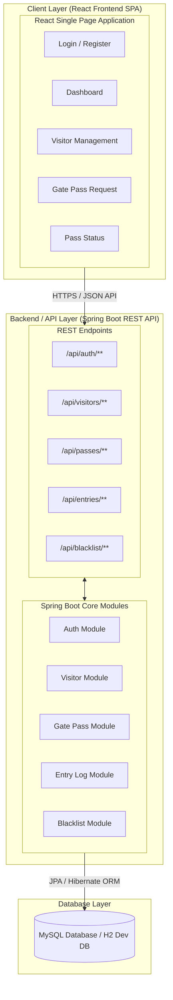
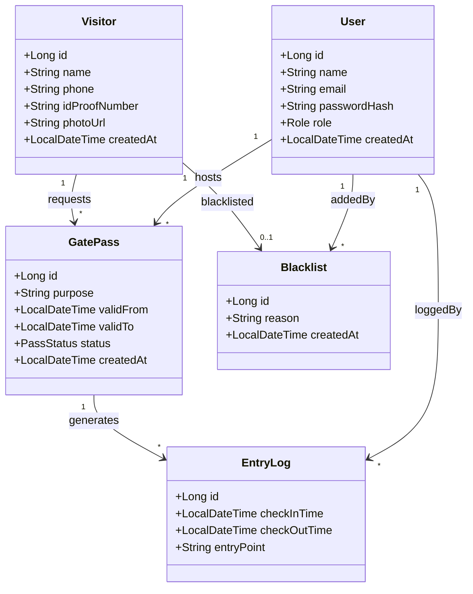
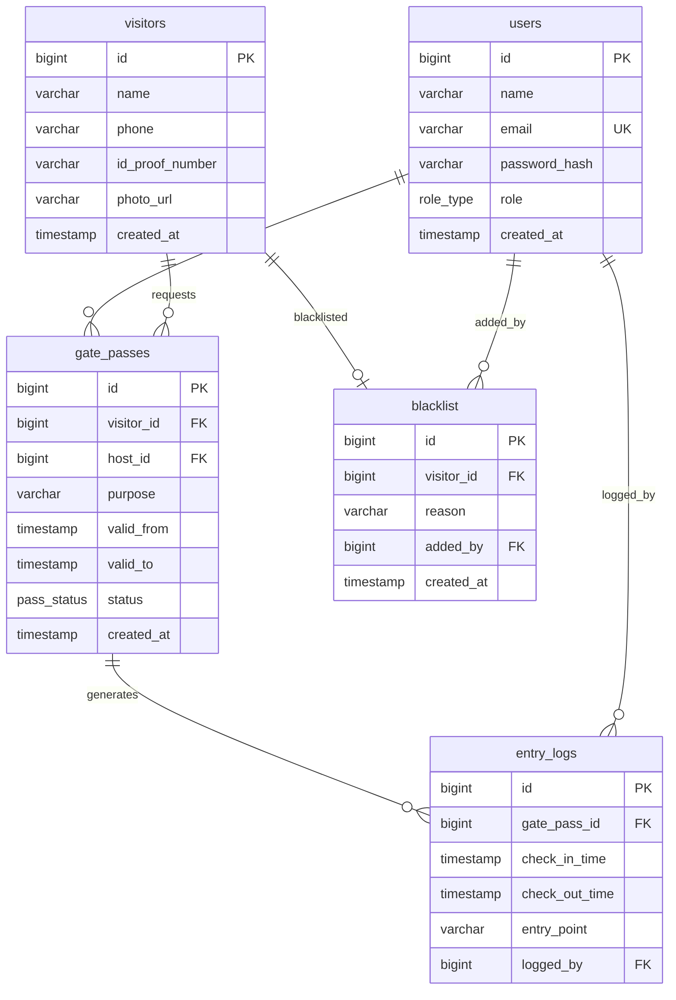

# Visitor Entry & Gate Pass Management System

> A modern, secure, and modular campus access control application built with **Spring Boot 3.x**, **Java 17**, and **React 18 (Vite)**.

---

## 👨‍💻 Author

**Sivaganesh L**  
B.Tech IT - III (Pre-Final Year)  
J.J. College of Engineering and Technology  
*Capstone Project (Domain #125 - Security / Facility Management)*

---

## 🌟 Features & Key Modules

1. **Role-Based Authentication & Authorization (RBAC)**
   - Roles: `ADMIN`, `GUARD`, `HOST`.
   - JWT-ready stateless security architecture.

2. **Visitor Directory & Management**
   - Digital registration with full name, phone number, ID proof number, and photo URL tracking.

3. **Gate Pass Request & Approval Workflow**
   - Visitor pass issuance linked to host employees.
   - Status tracking (`PENDING`, `APPROVED`, `REJECTED`, `EXPIRED`).

4. **Security Check-in & Check-out Entry Logging**
   - Physical gate entry logging by security guards with automatic timestamps (`check_in_time`, `check_out_time`, `entry_point`).

5. **Visitor Blacklist Registry**
   - Flags restricted individuals to prevent pass creation and enhance campus security.

---

## 🏗️ Architecture & Diagrams

### 1. System Architecture Diagram



---

### 2. UML Class Diagram



---

### 3. Entity-Relationship (ER) Schema



---

## 🛠️ Technology Stack

| Layer | Technology | Description |
| :--- | :--- | :--- |
| **Frontend** | React 18 (Vite) + CSS | Modular Single Page Application with Navbar, Sidebar, Context Providers, and Dashboard views. |
| **Backend** | Java 17 + Spring Boot 3.x | Layered REST API architecture (`controller`, `service`, `repository`, `model`, `dto`, `exception`, `util`). |
| **Security** | Spring Security | Encrypted passwords (`BCrypt`), CORS filters, and custom JWT request filter. |
| **Database** | MySQL / H2 | Relational schema with JPA Hibernate ORM (`users`, `visitors`, `gate_passes`, `entry_logs`, `blacklist`). |

---

## 📁 Repository Directory Structure

```text
visitor-gate-pass-system/
├── .env.example
├── .gitignore
├── CHANGELOG.md
├── LICENSE
├── Problem_Statement.md
├── README.md
│
├── docs/
│   ├── architecture_diagram.png
│   ├── class_diagram.png
│   ├── er_diagram.png
│   ├── schema.dbml                           # Source DBML schema for dbdiagram.io
│   ├── diagrams/
│   │   ├── architecture.md                   # System Architecture documentation
│   │   ├── class_diagram.md                  # UML Class & Module diagram documentation
│   │   └── schema.dbml
│   └── screenshots/
│       ├── login_page.png
│       ├── dashboard.png
│       └── visitor_list.png
│
├── backend/                                  # Java 17 + Spring Boot REST API
│   ├── .env.example
│   ├── pom.xml                               # Maven Build Dependencies
│   └── src/
│       ├── main/
│       │   ├── java/com/college/visitorgatepass/
│       │   │   ├── VisitorGatePassApplication.java
│       │   │   ├── config/                   # SecurityConfig, JwtFilter, CorsConfig
│       │   │   ├── controller/               # AuthController, VisitorController, GatePassController, etc.
│       │   │   ├── service/                  # Service interfaces (UserService, VisitorService, etc.)
│       │   │   ├── service/impl/             # Service implementations (UserServiceImpl, etc.)
│       │   │   ├── repository/               # UserRepository, VisitorRepository, GatePassRepository, etc.
│       │   │   ├── model/
│       │   │   │   ├── entity/               # User, Visitor, GatePass, EntryLog, Blacklist
│       │   │   │   └── enums/                # Role, PassStatus
│       │   │   ├── dto/                      # LoginRequest, LoginResponse, VisitorRequest, GatePassResponse, etc.
│       │   │   ├── exception/                # ResourceNotFoundException, GlobalExceptionHandler
│       │   │   └── util/                     # JwtUtil, ValidationUtil
│       │   └── resources/
│       │       ├── application.properties
│       │       ├── application-dev.properties
│       │       └── data.sql                  # Initial database seed file
│       └── test/
│           └── java/com/college/visitorgatepass/
│               └── VisitorGatePassApplicationTests.java
│
└── frontend/                                 # React 18 + Vite Frontend Application
    ├── .env.example
    ├── index.html
    ├── package.json
    ├── vite.config.js
    ├── public/
    │   ├── logo.png
    │   └── favicon.ico
    └── src/
        ├── main.jsx
        ├── App.jsx
        ├── App.css
        ├── index.css
        ├── api/                              # axiosConfig.js, visitorApi.js
        ├── components/                       # Navbar, Sidebar, Card, Loader
        ├── context/                          # AuthContext, UserContext
        ├── pages/                            # Login, Dashboard, Visitors, GatePass, EntryLogs, Blacklist
        └── utils/                            # constants.js, helpers.js
```

---

## 🚀 Quick Start Guide

### Prerequisites
- **Java JDK 17+**
- **Apache Maven 3.8+**
- **Node.js 18+** & `npm`

### 1. Run Backend Service
```bash
cd backend
mvn clean compile
mvn spring-boot:run
```
- Backend REST API will start at: `http://localhost:8080`
- Embedded H2 Console available at: `http://localhost:8080/h2-console`

### 2. Run Frontend Client
```bash
cd frontend
npm install
npm run dev
```
- React Frontend app will start at: `http://localhost:5173`

---

## 📜 License

This project is licensed under the terms of the [MIT License](LICENSE).
