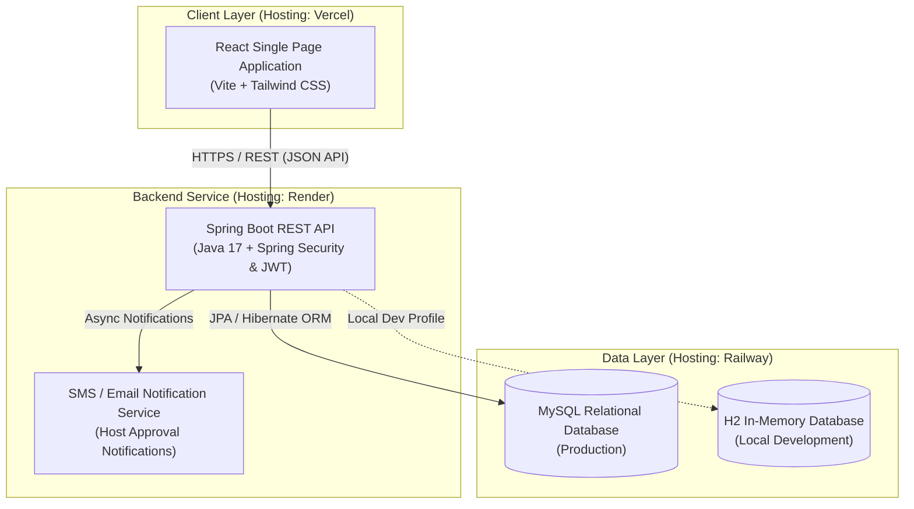

# System Architecture

## Architecture Diagram

## Component Boundaries

1. **Frontend Client (Vercel)**:
   - React SPA providing distinct dashboard UI views for **Admin**, **Security Guard**, and **Host/Employee**.
   - Handles client-side routing, JWT token storage, and responsive form submissions.

2. **Backend API (Render)**:
   - Spring Boot application exposing secure RESTful API endpoints.
   - Handles role-based authentication/authorization, business logic, validation, and host approval workflows.
   - Dispatches automated SMS/Email notifications to hosts upon visitor arrival.

3. **Database Storage (Railway / H2)**:
   - **Production**: MySQL database hosted on Railway for persistent storage of users, visitors, gate passes, entry logs, and blacklists.
   - **Development**: H2 in-memory database enabled locally with the `dev` profile for instant offline testing and prototyping.
