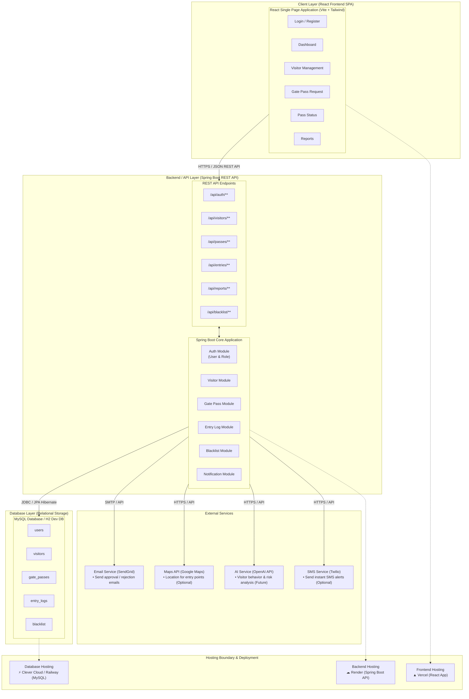

# System Architecture

## System Architecture Diagram

---

## Component Boundaries & System Summary

1. **Client Layer (React Frontend)**:
   - Built with **React** (Vite + Vanilla/Tailwind CSS).
   - Provides role-tailored dashboards for **Admin**, **Security Guard**, and **Host/Employee**.
   - Handles client-side routing, JWT authentication headers, and responsive forms.

2. **Backend / API Layer (Spring Boot)**:
   - **Java 17** application exposing modular REST APIs (`/api/auth/**`, `/api/visitors/**`, `/api/passes/**`, `/api/entries/**`, `/api/reports/**`, `/api/blacklist/**`).
   - Core Modules: `Auth`, `Visitor`, `Gate Pass`, `Entry Log`, `Blacklist`, and `Notification`.
   - Security: Spring Security + JWT authentication and role-based access control (RBAC).

3. **Database Layer (MySQL / H2)**:
   - Stores core persistent relational tables (`users`, `visitors`, `gate_passes`, `entry_logs`, `blacklist`).
   - Local development uses **H2 in-memory DB**; production uses **MySQL** on Railway / Clever Cloud.

4. **External Integrations**:
   - **SendGrid / SMTP**: Automated email dispatches to host employees upon visitor arrival.
   - **Twilio SMS**: SMS notifications to visitor and host phones.
   - **Google Maps & AI API**: Optional entry-point location mapping and risk prediction enhancements.

5. **Deployment & Hosting Infrastructure**:
   - **Frontend**: Deployed on **Vercel**.
   - **Backend API**: Deployed on **Render** / Railway via GitHub CI/CD.
   - **Database**: Hosted on **Clever Cloud** / Railway.
